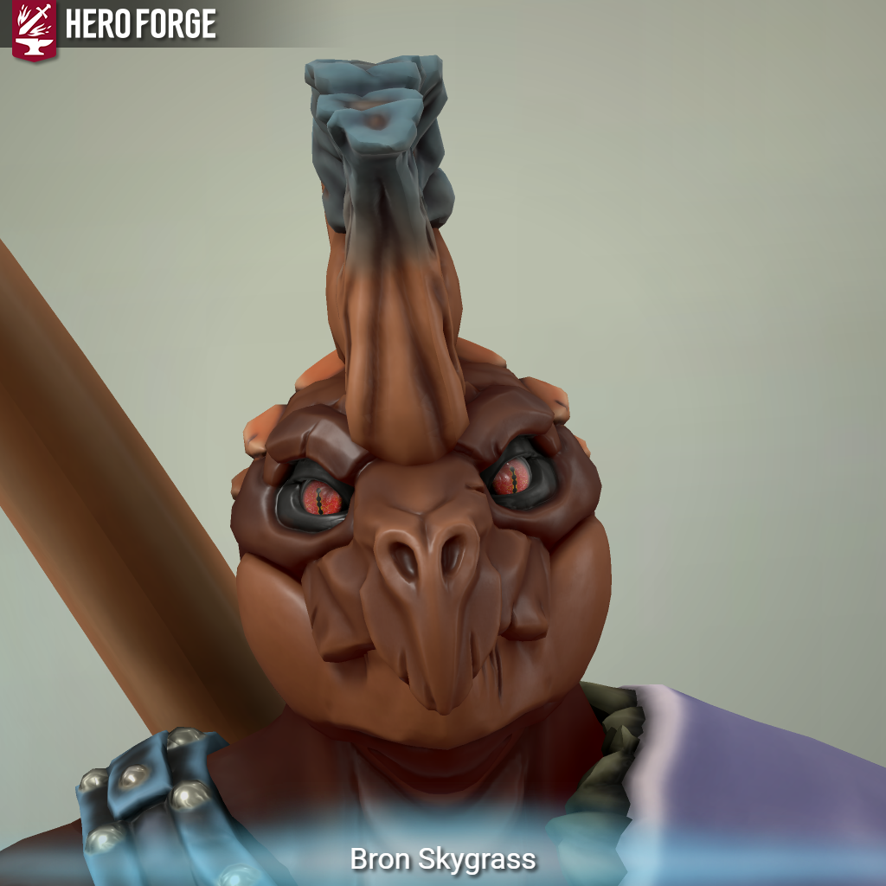

---
aliases:
  - ⚔️ Bron
  - Bron
---

class: [Fighter](https://roll20.net/compendium/dnd5e/Fighter#content) - [Champion](https://dnd5e.wikidot.com/fighter:champion)  
species: [Lizardfolk](https://dnd5e.wikidot.com/lineage:lizardfolk)  
Background: [Archaeologist](https://dnd5e.wikidot.com/background:archaeologist) 
## notes:
* Married to [[🍃 Vyracoria Ildil|Vyra]]
* gauntlet
	* dispel magic darts
* Has the [[✧ Spark]] after being teleported by a plains-walker
	* [[✨Spark Jump]] was learned after touching a rift

## Backstory

Bron Skygrass was hatched under the sweltering sun of the marshes, where instinct and survival were his people’s guiding laws. While most of his kin were content to live by tooth and claw, Bron’s mind burned with questions. As a hatchling, he uncovered strange fossilized bones in the mud—colossal, reptilian shapes older than even the elders’ tales. Where others saw broken rocks, Bron saw **echoes of giants**—ancestors who might explain where the lizardfolk truly came from. That spark never left him.

Unlike the stoic hunters of his tribe, Bron became a collector of fragments: carved stones, broken pottery, and especially bones of beasts long dead. He left his swamp, driven by the belief that his people were not simply scavengers of the present but heirs to something far greater. In his travels, he took on the skills of a fighter, for relics are rarely left unguarded—whether by monsters, traps, or jealous rivals. His champion’s path reflects his devotion to pushing the limits of his physical self, striving to become worthy of the titans he idolizes.

It was during one such expedition that he met **Vyracoria Ildil**, a dragonborn noble and druid of the Circle of the Moon. Where Bron sought bones, she sought the living spirit of nature. Their work often put them in opposition at first—she viewed his digging as desecration, while he considered her reverence naïve. But mutual respect grew from their debates. Vyracoria saw his strength tempered by curiosity and care, rare traits in a world that dismissed lizardfolk as little more than beasts. Bron, in turn, found in her a companion who valued the world’s mysteries as much as he did, even if they approached them differently.

Their marriage shocked her family. The Ildils, proud and aristocratic, believed lizardfolk to be little more than swamp-dwellers unfit to mingle with nobility. They call Bron a “lesser being,” sneering at his manners, his speech, and his lack of draconic bloodline. Bron endures this disdain with a cold patience typical of his kind—yet beneath that stoic mask lies a burning resolve to **prove himself not just worthy of Vyracoria, but of the legacy of his people.**

Bron’s life goal is clear: to uncover the **ruins of the primal lizardfolk civilization**, a culture that walked beside dinosaurs and perhaps even commanded them. He dreams of discovering not just bones, but a forgotten heritage—a truth that would silence the scorn of nobles and uplift his kin from the shadows of history. Each expedition, each relic he unearths, is a step closer to proving that his people are not “lesser,” but heirs to a titanic ancestry.

---
### **The Legend of the First Scales**

Among the oldest tales whispered in Bron’s tribe is the **Song of the First Scales**, a myth half-forgotten, spoken in clicks and hisses around fires made of swamp gas.

Long ago, before dragons soared and before elves carved their cities, the world belonged to the **Elder Beasts**—the great dinosaurs. They ruled not with words, but with tread and roar, shaping rivers, carving mountains, and birthing jungles with their passing.

The story goes that when the stars fell into the sea, the Elder Beasts gathered in council. They knew their time as rulers would end, for fire and frost came from beyond the skies. To preserve their legacy, they shed their scales in sacred places, each scale becoming an egg. From those eggs hatched the first **lizardfolk**, smaller than their sires, but gifted with cunning minds and hands fit to shape tools.

The dinosaurs left the world’s stage, retreating into earth and bone, while their children carried on their will. To the lizardfolk, these ruins and fossils are not just remnants—they are **holy footprints**, proof that they are not mindless scavengers but heirs to titanic ancestors.

---

Bron grew up with this myth as his guiding star. While other lizardfolk took it as metaphor, Bron believes it literally—that somewhere in the hidden corners of the world lies the **First Nest**, the ruins where the Elder Beasts shed their scales and birthed his people. Finding this site is not just a scholarly goal—it is Bron’s **destiny**.

Vyracoria’s heritage makes this all the more poignant. As a **silver dragonborn**, her lineage traces back to one of the oldest and most noble draconic bloodlines. Her parents wield their ancestry like a crown, sneering at Bron’s “mud-born” scales. Yet Bron quietly holds to the belief that his people’s blood is just as old, just as sacred—older, even, than the dragons themselves. He doesn’t flaunt it, but deep down he dreams of standing in those ruins, fossilized giants at his back, and declaring to her family: _“See. We were kings of the earth before your kind learned to crawl.”_

### **The Song of the First Scales**

_Common:_

> “Before the fire, before the frost,  
> the earth was theirs.  
> Titans of scale, keepers of bone,  
> they walked, and the world bent.”

_Primordial (with translation):_

> **“Thokh ra’thass, khur-vel ossa,  
> Goruun tha’kesh.  
> Kraash’ith, serra’nokh,  
> Avaruun thol.”**  
> _(Before the stars, before the storm,  
> the land was theirs.  
> Mighty scales, eternal teeth,  
> they became the ground.)_

_Common:_

> “From scale to egg, from egg to kin,  
> we rose from their gift.  
> Not lesser, not lost—  
> but heirs of the First Scales.”

---

### **The Sigil of the First Scales**

**Design Elements:**

- **Central Spiral:** At the heart of the sigil is a **spiral**—a symbol of cyclical time, the rise and fall of civilizations, and the eternal nature of the Earth. This spiral represents the first lizardfolk’s connection to the Earth and the great Elder Beasts that shaped the world.
    
- **Clawed Handprints:** Surrounding the spiral are **two curved claw marks**, resembling the hand of a mighty dinosaur. These represent the connection between Bron's people and the dinosaurs, emphasizing that the lizardfolk were shaped and gifted by these titanic creatures.
    
- **Teardrop-Shape:** The outer border of the sigil forms a **teardrop-like shape**, referencing both the eggs of the Elder Beasts and the life force passed down to the lizardfolk. This shape emphasizes the _sacredness of the legacy_ that lives on through Bron and his kin.
    
- **Triangular Markings:** Above and below the spiral are **triangular glyphs**, each representing one of the four elements—earth, fire, water, and air. These mark the primal forces at play in the world when the first scales were shed and are a reminder of the ancient lizardfolk’s bond with nature.
    

---

**Representation**

- The sigil is carved into on his armor, and on the soft bits on his weapons as a reminder of his journey to reclaim his people's lost legacy.

## Image:

