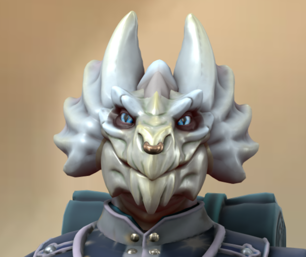

---
aliases:
  - 🍃 Vyra
  - Vyra
---

class: [Druid](https://roll20.net/compendium/dnd5e/Druid#content) [Circle of the moon](https://www.dndbeyond.com/posts/629-druid-101-circle-of-the-moon?srsltid=AfmBOorOyj-eThy-gSs5b6a2i6Rhumu92Fd3HncoBp37T0RrqnFr4DQO)  
species: [Dragonborn](https://roll20.net/compendium/dnd5e/Dragonborn#content)  
## notes:

* Married to [[⚔️ Bron Skygrass|Bron]]
* [Noble](https://roll20.net/compendium/dnd5e/Noble#content)
* Got [[😵Blinding Smite]] from the rift
- [[🥚 Silver Dragon Egg|Silver dragon egg]] - received after the dream sequence [[Game Notes#One-shot "dream"|One Shot]]
- Hometown of [[Game Notes#Velmara|Velmara]]
- Disowned [[Game Notes#Velmara|At her Parent’s Estate in Velmara]]
#### Aliases
+ Vyra
## backstory:
[[🍃 Vyracoria Ildil]], known simply as[[🍃 Vyracoria Ildil|Vyra]] to her friends, was born into the ancient Ildil lineage, a proud family of silver dragonborn nobles whose estates gleamed like polished steel under the sun. From her earliest years, she was raised in an environment of rigid tradition, diplomacy, and wealth. Tutors drilled her in the histories of dragon-kind, her parents spoke endlessly of lineage and honor, and every banquet was a theater of polite rivalry among noble houses.

Despite this gilded upbringing, Vyra's heart leaned toward compassion rather than pomp. She believed that respect — for one another, for the land, for even the humblest of creatures—was the truest measure of nobility. She would linger at the servants’ tables, listening to their stories, or sneak away to the gardens to tend the herbs with the groundskeepers. Her parents scolded her often, accusing her of "lowering herself." Yet Vyra never saw kindness as lowering—it was lifting others up.

Her world shifted when she met [[⚔️ Bron Skygrass]], a lizardfolk fighter with a scholar’s mind. An archaeologist by trade, he spent his days exploring ruins, unearthing forgotten relics, and piecing together the stories of civilizations long buried. His work required both martial skill—to protect himself in dangerous places — and an unyielding curiosity. Where her kin saw only a “lesser being,” Vyra saw a soul as steady as the mountains and as deep as the rivers. Their paths crossed when Bron requested entry to survey ruins near the Ildil estate. Where Vyra’s kin dismissed him as a mercenary scavenger, she was captivated. His pragmatic honesty, his reverence for the past, and the way he treated even broken shards of pottery with dignity resonated with her own values. Bron’s blunt honesty, his reverence for survival and history, and his quiet strength fascinated her. Over time, they met in secret, speaking of history, nature, and the future they longed for.

But when her parents discovered their bond, fury erupted. The Ildil name, they claimed, could not be tarnished by such a union. They hurled insults at Bron — they derided his work, mocked his heritage, and ordered Vyra to cut ties. To Vyra, this cruelty was unbearable. To deny Bron was to betray not just her heart, but her belief in the sanctity of respect.

That night, beneath a silvered sky, she made her choice. She gathered a modest sum of coin — what seemed paltry compared to her family’s wealth, but enough to start anew — and left the Ildil estate behind. She left the gilded cage of her family behind, chasing a life where love and dignity mattered more than bloodlines.

In the wilds, she found solace. The whispers of the wind, the embrace of the moon, and the endless cycle of life drew her into the path of the Circle of the Moon. Among druids, she discovered a community that valued balance and respect for all living things. Her faith deepened in Io, the Nine-fold Dragon, whose eternal balance mirrored her own convictions: all beings, regardless of shape or scale, are threads in the same tapestry.

Now Vyra travels alongside Bron. To her, his battles to preserve history and her devotion to the balance of nature are not opposed but intertwined: both are acts of reverence for what has been, what is, and what may yet come. She walks with pride not in her noble name, but in her chosen path — a silver dragonborn who seeks to embody the radiant respect she treasures above all else. She is quick to defend the downtrodden, fierce in protecting the natural world, and unyielding in her belief that love and dignity transcend blood or race.

Where her family saw shame, Vyra has found freedom. And though she sometimes feels the sting of her exile, she would choose it again, for her heart is bound not to gold or titles, but to respect, love, and the moonlit wilds.
## Image:

