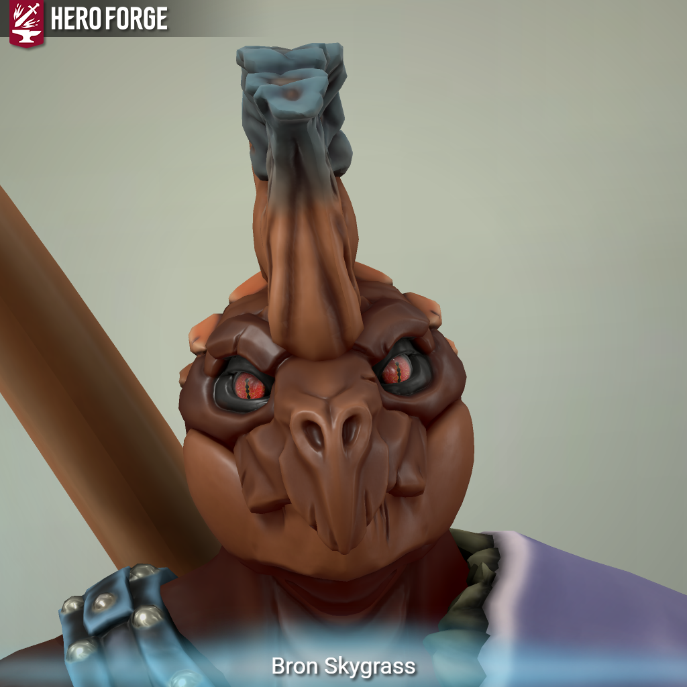

---
aliases:
  - Bron
---
class: [Fighter](https://roll20.net/compendium/dnd5e/Fighter#content) - [Champion](https://dnd5e.wikidot.com/fighter:champion)  
species: [Lizardfolk](https://dnd5e.wikidot.com/lineage:lizardfolk)  
Background: [Archaeologist](https://dnd5e.wikidot.com/background:archaeologist) 
## notes:

* Married to [[Vyracoria Ildil]]
* gauntlet
	* dispel magic darts
* Has the [[Spark]] after being teleported by a plains-walker
	* [[Spark jump]] was learned after touching a rift

