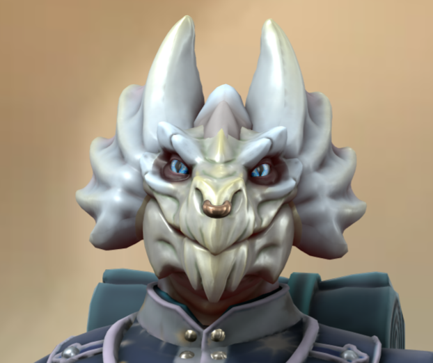

---
aliases:
  - Vyra
---
# :RaZigzagLeaf: Vyracoria Ildil
class: [Druid](https://roll20.net/compendium/dnd5e/Druid#content) [Circle of the moon](https://www.dndbeyond.com/posts/629-druid-101-circle-of-the-moon?srsltid=AfmBOorOyj-eThy-gSs5b6a2i6Rhumu92Fd3HncoBp37T0RrqnFr4DQO)
species: [Dragonborn](https://roll20.net/compendium/dnd5e/Dragonborn#content)
## notes:

* Married to [[Bron Skygrass]]
* [Noble](https://roll20.net/compendium/dnd5e/Noble#content)
* **Blinding smite** (3 times)-The next time you hit a creature with a melee weapon attack during this spell’s duration, your weapon flares with a bright light, and the attack deals an extra 3d8 radiant damage to the target. Additionally, the target must succeed on a Constitution saving throw or be blinded until the spell ends.
	* A creature blinded by this spell makes another Constitution saving throw at the end of each of its turns. On a successful save, it is no longer blinded.
- [[silver dragon egg]] - received after the dream sequence ([[One-shot]])

## Image:

